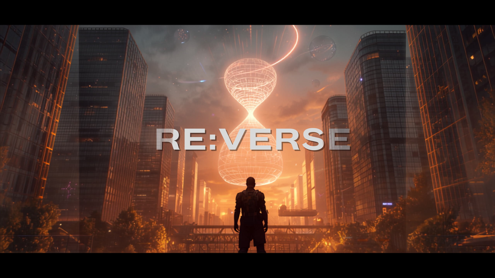
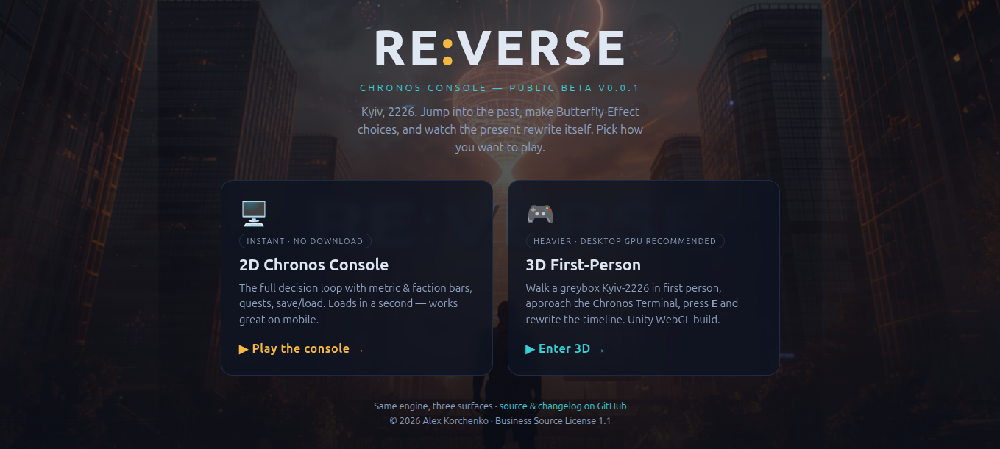
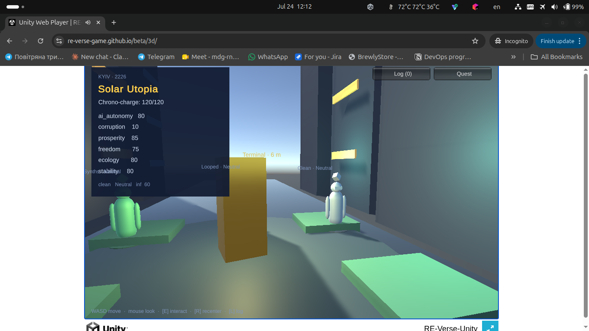
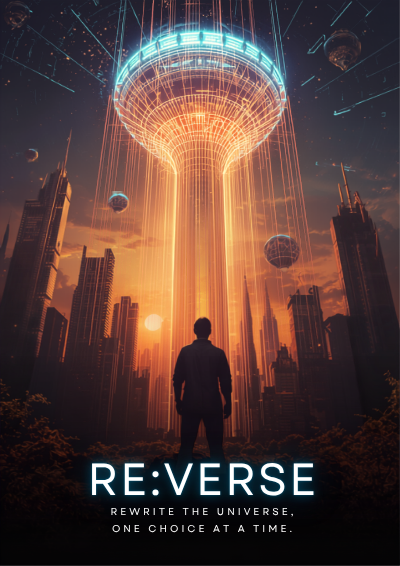
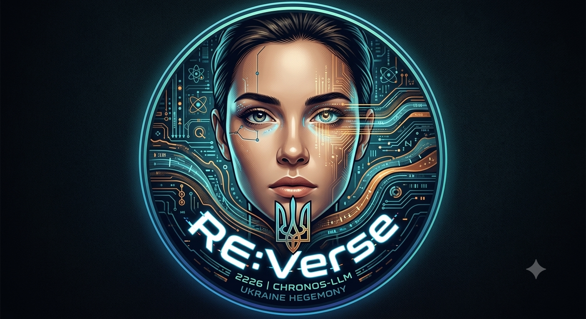

<p align="center">
  
</p>

<h1 align="center">RE:VERSE — public beta</h1>

<p align="center">
  <b>Rewrite the universe, one choice at a time.</b><br />
  A Ukrainian solarpunk / cyberpunk time-travel game built around an embedded <b>Chronos-LLM</b>.
</p>

<p align="center">
  <a href="https://re-verse-game.github.io/beta/"><b>▶ PLAY IN THE BROWSER</b></a>
  &nbsp;·&nbsp; no install &nbsp;·&nbsp; no sign-up &nbsp;·&nbsp; works on desktop &amp; mobile
</p>

<p align="center">
  
  
  
  
</p>

---

## What is this?

You jump into Ukraine's past eras (**2058 · 2090 · 2150 · 2180**), make
**Butterfly-Effect** choices, and the present of **2226** rewrites itself in
real time. Every jump drains your **quantum batteries**, choices **cascade
across eras** (what you change in 2058 unlocks or locks options in 2090+), and
your goal is to reassemble the **★ Solar Utopia** — while dodging the
AI-Technocracy, Cyber-Feudal Collapse and Fractured-Timeline endings.

This repository hosts the **browser vertical slice** — a self-contained,
no-build front-end that runs the exact same deterministic decision engine as
the full prototype (a faithful JS port of the Python/C# core).

> This is a **playable beta**, not the final AAA game. It is the *core hook*,
> distilled to something anyone can open and feel in under a minute.

## Play

**→ [re-verse-game.github.io/beta](https://re-verse-game.github.io/beta/)** — the
launcher lets you pick how to play:

| Mode | Link | Notes |
| --- | --- | --- |
| **2D Chronos Console** | [`/2d/`](https://re-verse-game.github.io/beta/2d/) | Full loop, instant load, works on mobile |
| **3D First-Person** | [`/3d/`](https://re-verse-game.github.io/beta/3d/) | Unity WebGL — walk Kyiv-2226, press **E** at the terminal (desktop GPU recommended) |

Both run the same shared engine. The 2D console: Prologue → **Enter the
Continuum** → **Chronos Jump** into an era → pick a choice → watch 2226's metric
&amp; faction bars rewrite → chase the ★ Solar Utopia victory.

| Action | What it does |
| --- | --- |
| **⟲ Chronos Jump** | Travel to an era and change one thing (the deeper the era the dearer the wormhole, and the louder you have already edited history the more every later jump costs — plus a surcharge if you tore that era open) |
| **◈ Quest** | Generate a side-quest from the current world-state |
| **◌ Lay low** | Go dark to shed Temporal Heat, paid for out of your Trust Mesh standing |
| **⌬ Market** | Spend Energy Creds on a battery boost or a grey-market Mesh scrub — your standing sets the price |
| **⚕ Bio-clinic** | Spend the same creds on yourself: a four-augment tree, each install leaving permanent bio-strain — enough of it and the Mesh stops reading you as baseline human. Recovery pods flush it back out |
| **◈ Zones** | Ride the maglev between Kyiv, the Carpathians and Odesa. Each has its own Smart Dust density, so where you launch a jump from decides how loud it is — but the Chronos anchor is under Kyiv, and the quiet zones charge for the distance. Canton's weather runs on a published schedule that only advances while you spend time in 2226 |
| **≡ Timeline** | Review every change you've made |
| **↶ Rewind** | Undo your last change and release its energy |
| **⟳ Reset** | Restore the pristine timeline and full charge |
| **▼ Save / ▲ Load** | Persist your run to the browser's `localStorage` |

## Screenshots

**The launcher** — pick how you play (2D console or 3D first-person):

<p align="center">
  
</p>

**3D first-person slice** — walk a greybox Kyiv-2226, live HUD (archetype,
chrono-charge, metrics, factions), approach the Chronos Terminal and press **E**:

<p align="center">
  
</p>

**Key art:**

<p align="center">
  
  &nbsp;&nbsp;
  
</p>

## Run it locally

It's a static site — no server or build needed.

```bash
git clone https://github.com/RE-Verse-game/beta.git
cd beta
xdg-open index.html      # Linux  (or just double-click index.html — opens the launcher)
```

Optional sanity checks (Node):

```bash
node 2d/engine.test.js   # engine parity checks mirroring the Python invariants
```

## What's inside

```
index.html          # launcher — choose 2D or 3D
2d/                 # 2D Chronos console
  index.html        #   game shell (prologue, metrics, factions, victory)
  style.css         #   Ukrainian solarpunk / cyberpunk theme
  engine.js         #   pure decision engine — deterministic, no DOM
  app.js            #   DOM controller wiring the engine to the UI
  engine.test.js    #   Node sanity checks
3d/                 # 3D first-person (Unity WebGL build — see 3d/README.md)
media/              # key art (hero, poster, emblem)
```

The 3D slice ships as a Unity **WebGL** export dropped into `3d/`. To build and
add it, follow **[`3d/README.md`](3d/README.md)** — the key gotcha is setting
Unity's **Compression Format → Disabled** so it serves from GitHub Pages.

## Changelog

See **[CHANGELOG.md](CHANGELOG.md)**. Current release: **v0.0.5** — the Smart Dust
surveillance field, its weather grid and the maglev between the three zones.

## About the full project

RE:Verse is a first-person, open-world game set in a Ukrainian solarpunk /
cyberpunk **2226**, built around an embedded **Chronos-LLM** that mutates a
structured world-state from the choices you make in the past. Beyond this
browser slice there is also a CLI prototype and a Unity first-person 3D slice
(with a WebGL export), all sharing one engine.

## Credits &amp; license

RE:Verse — concept, design, engine and key art © 2026 **Alex Korchenko**.

Licensed under the **Business Source License 1.1** (BSL 1.1) — see
**[LICENSE](LICENSE)**. In short: you may play and evaluate the game for
personal, non-commercial purposes and host an unmodified copy for playtesting;
any commercial or hosted-for-third-parties use needs a separate commercial
license. On the **Change Date (2030-07-24)** the work converts to the
**Apache License, Version 2.0**. BSL is not an Open Source license, but this
work will become open source on that date.

For commercial licensing, contact **geekojinetwork@gmail.com**.
